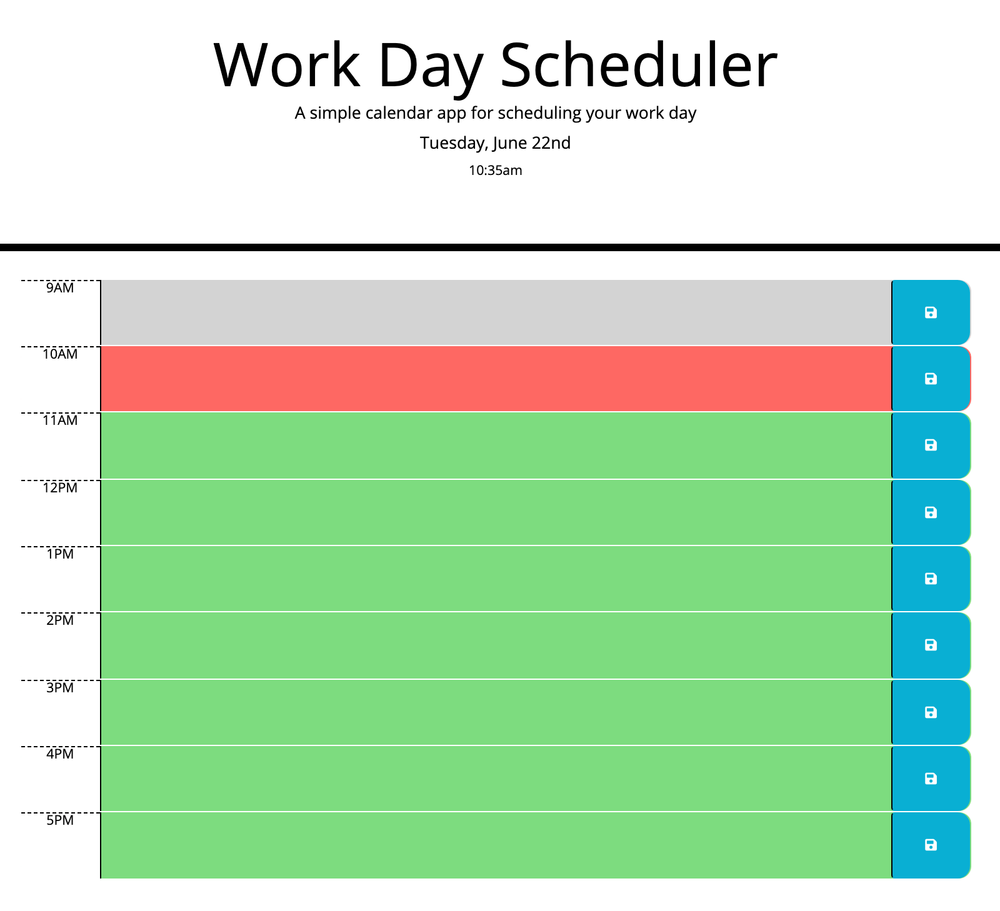

# Workday Calendar

[](https://blen90.github.io/workday-calendar/)

# Description

This app allows the user to have a WorkDay Calendar. The user can add different appointments, meetings that are stored in local storage. 


## Deployed App link 

https://blen90.github.io/workday-calendar/

## Screenshots of the app



# Table of Contents

* [Installation](#installation)
    
* [Usage](#usage)

* [Technology](#technology)

* [License](#license)

* [Contributors](#contributors)

* [Questions](#questions)

# Installation


# Usage


# Technology

* HTML
* JavaScript
* jQuery
* CSS
* MomentJs


# License 

This project is governed by: MIT License

# Contributors

Blenda Orellana

# Questions

If you have any questions about the repo or the app please feel free to contact me
 * Email: blen.or90@gmail.com
 * Github: https://github.com/blen90

## Link to my deployed repository

https://blen90.github.io/workday-calendar/

## My task

My task for this homework was to work on a Work Day Scheduler. An HTML and a CSS file was provided to me and I needed to work on the JavaScript file by using jQuery, Bootstrap and Moment JS. 

The criteria to meet for this homework was the following:
```
GIVEN I am using a daily planner to create a schedule
WHEN I open the planner
THEN the current day is displayed at the top of the calendar
WHEN I scroll down
THEN I am presented with timeblocks for standard business hours
WHEN I view the timeblocks for that day
THEN each timeblock is color coded to indicate whether it is in the past, present, or future
WHEN I click into a timeblock
THEN I can enter an event
WHEN I click the save button for that timeblock
THEN the text for that event is saved in local storage
WHEN I refresh the page
THEN the saved events persist

```

## Prerequisites
Before you begin, ensure you have met the following requirements:
* You have installed the latest version of Visual Studio Code. 
* You are using a Windows or Mac OS machine. OS version 10 or above.
* You have installed the lastest Google Chrome browser.

## Screenshot of Work Day Schedule

